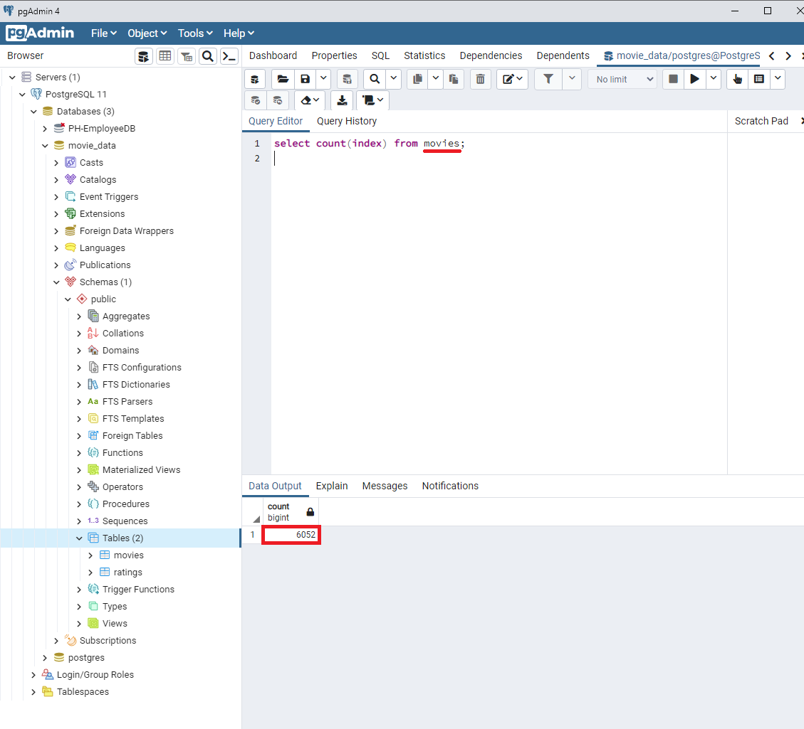
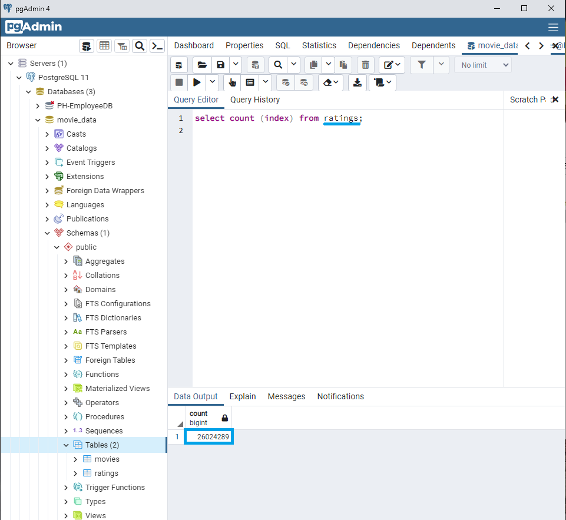
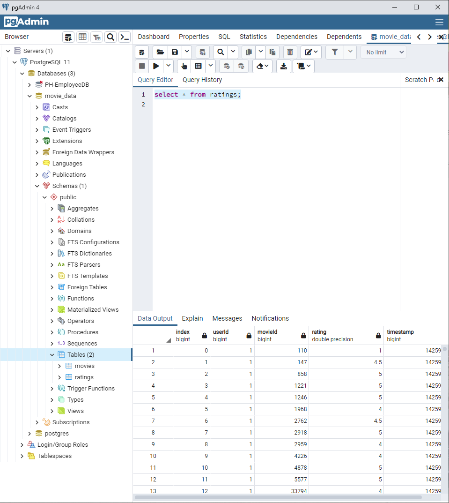

# Movies_ETL

## Purpose
A popular streaming service has indicated a need to research and identify which low budget movies are most likely to succeed on their platform. If a low budget movie's success is predicted early, the streaming service has the ability to purchase the streaming rights to the movie at a fraction of the cost compared to the cost after it becomes popular. To inspire their team and connect with the local coding community the streaming company wants to sponsor a 'Hackathon', in which participants are provided a clean data set and are asked to make predictions about which movie(s) from the data set will be most successful. 

A member of the streaming service team has been tasked with developing the dataset that will be used for the 'Hackathon'. This data set will be comprised of data from two sources: a scrape of wikipedia for all movies released since 1990, and rating data from the movieland.com website. The data will need to be extracted from the two sources, transformed into one clean data set, and loaded into a SQL table. 

The streaming service team member in charge of creating the table has done a great job in sourcing and loading the data, however the streaming service wants to keep the data updated on a daily basis for their purposes. The task is to create an automated data pipeline that takes in new data, performs the appropreate transformations, and loads the data into existing tables. The data used for this daily update comes in the form of three files: Wikipedia data, Kaggle metadata, and MovieLens rating data. The deliverables for this task are as follows:
* Deliverable 1: Write an ETL function to read the three data files.
* Deliverable 2: Extract and transform the Wikipedia data.
* Deliverable 3: Extract and transform the Kaggle data.
* Deliverable 4: Create the Movie Database
 

Above: Total number of entries in the 'Movie' table

Above: The 'Movie' table

Above: The total number of entries in the 'Ratings' table

Above: The 'Ratings' table
